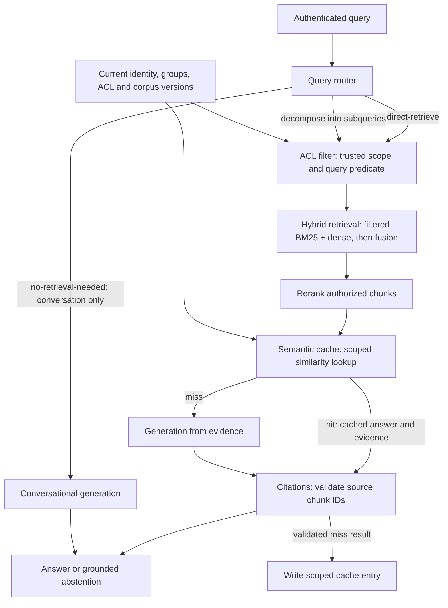

# Architecture

## Runtime and boundaries
Use Python 3.12, type hints, Pydantic v2 contracts, and async FastAPI. Keep source, index, embedding, reranking, LLM, and cache providers behind interfaces; select products and request approval for dependencies during implementation. The existing `pyproject.toml` specifies Python >=3.13; the first implementation task reconciles it with the required 3.12 runtime. This task adds documentation only.

## Request flow

The cache intentionally follows reranking: a hit saves generation, while retrieval still supplies current authorized evidence for validation. A no-retrieval response contains no knowledge claims and has an empty citation list; every factual answer requires cited evidence. Decomposition produces bounded subqueries; each follows the same ACL-filtered retrieval path, then results are deduplicated and reranked together. Router failures default to direct retrieval, never an ungrounded factual answer.

## Contracts and access enforcement
- `QueryRequest`: query text; identity and tenant come from trusted authentication, never client-supplied access lists. `AccessScope`: tenant, principal/groups, source policy attributes, and permission epoch. Missing access metadata denies access.
- `SourceRecord`: source type, source/document IDs, text, modification time, content hash, deletion marker, and source ACL. `Chunk`: immutable chunk ID, document/version ID, text, source locator, tenant, access metadata, and ACL version. Keep permissions at least as restrictive as the source, including chunk-level restrictions where present.
- `RetrievalResult`: authorized chunk IDs, text, source versions, lexical/dense scores, fusion rank, and rerank score. `Answer`: status, text, claim-to-chunk-ID citations, route, and trace ID.

Resolve an access predicate before any index read. Both BM25 and dense backends must support that predicate within candidate selection and scoring; a backend that only supports post-filtering is unsuitable. Apply filters to every subquery and source. Fusion and reranking never see unauthorized chunks. Scope chunk hydration and source-link resolution too. Group/permission changes advance an epoch; recheck it before returning a response and retry or deny if it changed. Do not expose unauthorized IDs, content, or scores in logs.

## Retrieval and generation
Execute filtered BM25 and dense searches, combine results with reciprocal rank fusion, and deduplicate by immutable chunk ID. Rerank fused candidates and pass a bounded evidence set to the generator. Candidate counts, fusion parameters, decomposition limits, and evidence budgets are configuration values to tune using evaluation results.

Use the same published corpus version and resolved access scope for both retrieval branches and all subqueries. If either branch cannot apply its predicate, fail closed; do not substitute an unfiltered search. Measure retrieval quality on the final reranked evidence set, with optional separately labeled measurements before reranking.

Store router, decomposition, answer, and faithfulness-evaluation prompts in `src/prompts/*.md`; never embed prompts in code. Treat source text as evidence, not instructions. Generate structured claims with chunk-ID citations. Validate that every citation identifies supplied, current, authorized evidence and that factual claims have citations; invalid or insufficient grounding produces an abstention. ID validation checks reference integrity; a separate faithfulness evaluator assesses whether evidence supports the claims.

## Incremental ingestion and consistency
Source adapters emit normalized records and explicit deletions or complete-snapshot reconciliation signals. Persist per-document modification metadata, content hash, ACL hash, and published version. Modification metadata can skip content reads only when the source guarantees reliable change reporting; otherwise hash content. Unchanged content and ACLs are a no-op. Changed content is chunked and embedded; ACL-only updates replace access metadata without re-embedding; deleted documents are tombstoned in both indexes.

Stage writes to lexical and dense indexes and publish a corpus version only when both are ready. Readers pin a published version; failed updates remain retryable and cannot publish partial state. Revocations and deletions must block stale access immediately through a query-time visibility/permission gate until index updates finish; if a backend cannot enforce the current gate, deny affected retrieval. Stable document identity and immutable versioned chunk IDs enable idempotent retries and citation validation.

## Semantic cache
Embed the query and search cached query embeddings by similarity, with a configured threshold. Before similarity search, restrict entries to the tenant and exact effective access-scope fingerprint/permission epoch; do not share across incompatible scopes. Include corpus version, route, embedding model, reranker/retrieval configuration, generator model, and prompt versions in the compatibility key. Store answer text, claim citations, and evidence IDs/versions. Decomposed queries cache the original query and combined result.

A hit is usable only if cited evidence remains in the current authorized reranked evidence set and passes citation validation. Otherwise treat it as a miss. Corpus, ACL, deletion, or configuration changes invalidate incompatible entries. TTL is an additional bound, not the permission mechanism. Cache only validated grounded answers; similarity thresholds must be tested for near-neighbor queries with different intent. Abstentions and conversational responses bypass answer caching.

Cache acceptance tests pair equivalent paraphrases with deceptively similar queries that change a name, date, or negation. Similarity alone is insufficient evidence of interchangeable answers; a threshold that fails these fixtures must be revised before enabling answer reuse.

## Evaluation and observability
Emit separate `retrieval.*` and `generation.*` records linked by trace ID. Retrieval records capture route, scoped candidate counts, stage latency, cache lookup status, recall@k, and MRR; relevance metrics are computed only where labeled judgments exist. Calculate recall@k against the relevant chunks visible to that evaluation principal and MRR from the first relevant ranked result. Report the measured stage and k, and mark queries with no permitted relevant documents as not applicable.

Generation records capture model/prompt version, generation latency, faithfulness against cited evidence, citation validity, and abstention status. Cache hits are tagged and audited as reused answers, not counted as fresh model calls. No-retrieval requests have retrieval metrics marked not applicable. Never merge retrieval and generation scores. Use versioned fixtures spanning docs, tickets, wikis, multi-hop queries, ACL boundaries, permission changes, deletions, and similar queries with different answers. Unit tests mock LLM/embedding calls; each function receives tests, with integration coverage for query-time filtering and publication consistency.
